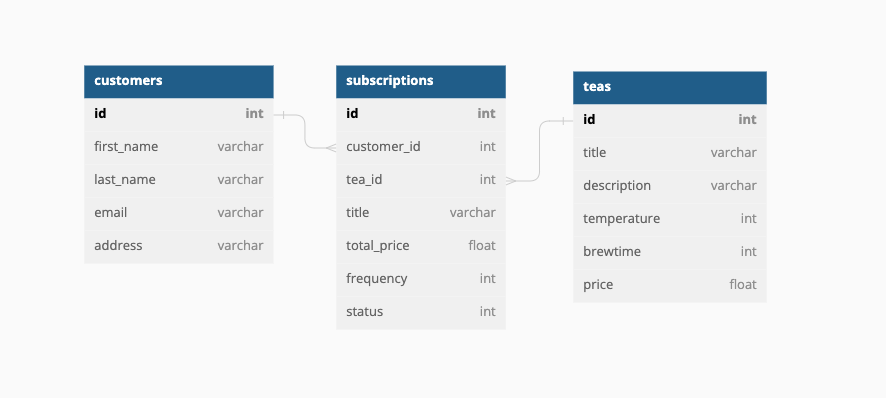

# README 
## Cloning and Running

1. Clone the repository
1. Run `bundle install`
1. Run `rails db:{create,migrate,seed}`
1. run `rails s` to be able to call the endpoints

## Versioning
- Ruby 2.7.2
- Rails 6.1.7


## Database Structure


For simplicity under time constraints, this database uses one-to-many relationships between tables.

## Endpoints

There are 3 endpoints available in this API. The database is also seeded with 3 customers, and 3 teas.

### GET /api/v1/subscriptions
The endpoint requires a request body with the following:

```json
{
  "customer_id": 1
}
```

### POST /api/v1/subscriptions
This endpoint is used for creating a new subscription for a customer. The frequency of a subscription can be `weekly`, `biweekly`, or `monthly`, and the total_price for the subscription will be calculated based on the frequency and tea price. The endpoint requires a request body of the following:

```json
{
  "customer_id": 1,
  "tea_id": 1,
  "frequency": "weekly"
}
```

### PATCH /api/v1/subscriptions 
The `PATCH /api/v1/subscriptions` endpoint is currently limited purely to activating or deactivating a given subscription. Possible functionality would include adding/removing teas, and changing frequency. Status' are represented in binary, with `0` representing `active`, and `1` representing `inactive`, respectively. The endpoint requires a request body who's structure is that of the following:

```json
{
  "subscription_id": "1",
  "status": 0
}
```

## Misc 

Because this was a short take-home project for the program I'm attending, there's a lot of functionality that doesn't exist that seemingly should, or things that don't seem as rounded out in structure because there wasn't enough time to implement it. Several things that I would do if given more time to improve this application and make it more rounded it out would be:

* Automatically creating an API key attached to each customer and creating those checks (e.g., a required field within the body of a request) to restrict who can make requests to the application 
* Restrict user CRUD functionality solely to their own subscriptions 
* Make subscription cost based off of the types of tea, quantity, and frequency, instead of having it statically set
* Create tea 'bundles' to more effectively show why the database was structured the way it was 
* Find teas based off of more unique, salted names, or purely by ID instead of by plain names in both request bodies and the controller